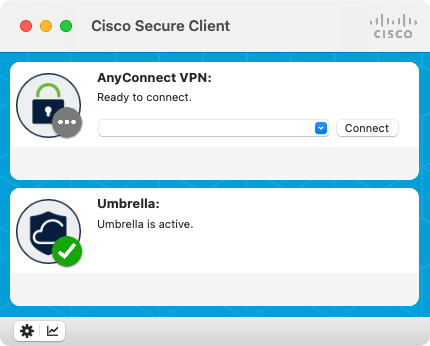

This script detects the current setting for the VPN module for Cisco Secure Connect being enabled or disabled.

If disabled, the script prompts the logged-in user and asks if they want to enable the VPN module. 

If the logged-in user chooses to enable the VPN module, the following value should be set in the XML file:

`<ServiceDisable>false</ServiceDisable>`

The VPN module should then appear in the Cisco Secure Client app window.

If enabled, the script prompts the logged-in user and asks if they want to disable the VPN module. 

If the logged-in user chooses to disable the VPN module, the following value should be set in the XML file:

`<ServiceDisable>true</ServiceDisable>`

The VPN module should not appear in the Cisco Secure Client app window.

Note: The script should be run with root privileges in order to make the changes to the relevant file:

`/opt/cisco/secureclient/vpn/profile/VPNDisable_ServiceProfile.xml`